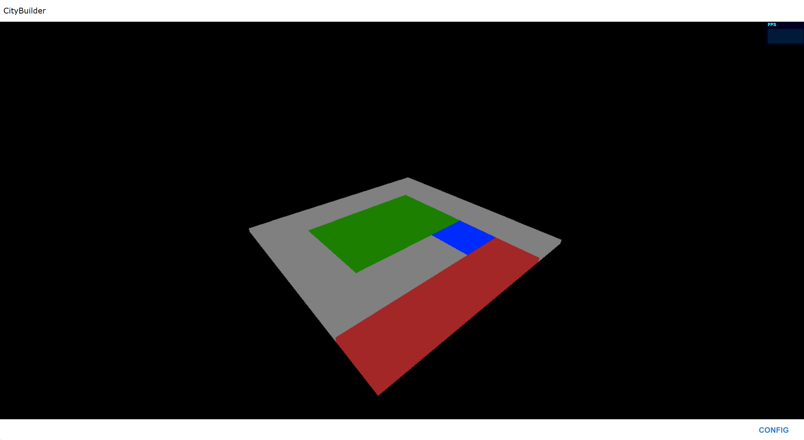

# CityBuilder: TypeScript + config based OOP Architecture + WebGL + Firebase
The goal is to learn config based Object-Oriented Programming architecture, with TypeScript, by building a city.

The city configuration will be shared among developers through a Firebase Realtime Database.
Any remote configuration change will instantly reflect on every developer's rendered city.
Have fun, be creative to make a lively city!

Notice: This repository's base is a fork of [Three.js-TypeScript-Boilerplate](https://github.com/Sean-Bradley/Three.js-TypeScript-Boilerplate).

### Rendering




## Setup

1. Clone Repository

```bash
git clone https://github.com/nfavaron/citybuilder.git
```

2. CD into folder

```bash
cd citybuilder
```

3. Install TypeScript

```bash
npm install -g typescript
```

4. Install dependencies

```bash
npm install
```

5. Copy/paste your Firebase project configuration into application.config.ts

```
  /**
   * Firebase configuration
   */
  firebaseConfig = {
    apiKey: "",
    authDomain: "",
    databaseURL: "",
    projectId: "",
    storageBucket: "",
    messagingSenderId: "",
    appId: ""
  };
```

5. Start it

```bash
npm run dev
```

6. Open [http://localhost:4200](http://localhost:4200) in your browser

You should see colored cubes, and be able to rotate it with your mouse.
